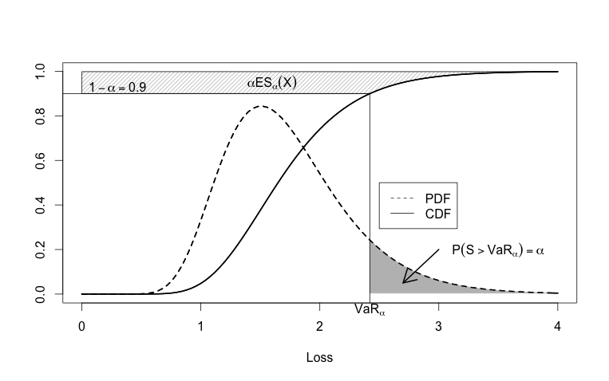

[](http://quantlet.de/index.php?p=info)

## [](http://quantlet.de/) **MSM_VaRandES** [](http://quantlet.de/d3/ia)

```yaml

Name of QuantLet : MSM_VaRandES

Published in : MSM

Description : 'Plots Value at Risk and Expected Shortfall in one figure and shows the relationship
between VaR and ES.'

Keywords : VaR, expected shortfall, lognormal, pdf, cdf, plot

Author : Chen Huang

Author [New] : Torsten Becker, Viktor Sandor

Submitted : Thu, November 5 2015 by Chen Huang

```




```r

# clear all variables
rm(list = ls(all = TRUE))
graphics.off()

dlognormalLoss = function(x) {
  dlnorm(x, 0.5, 0.3)  # the density function
}

plognormalLoss = function(x) {
  plnorm(x, 0.5, 0.3)  # the distribution function 
}

curve(plognormalLoss, 0, 4, xlab = "Loss", ylab = "", lwd = 2)
curve(dlognormalLoss, 0, 4, col = " black", lty = 2, lwd = 2, add = TRUE)

# Fill in the part beyond VaR with shadow
x = seq(2.42, 4, length = 100)
y = dlognormalLoss(x)
x = c(2.42, x)
y = c(dlognormalLoss(4), y)
polygon(x, y, col = "grey", border = "grey")
text(3.5, 0.2, expression(P(S > VaR[alpha]) == alpha))
arrows(3, 0.2, 2.7, 0.05, lwd = 2)

mtext(expression(VaR[alpha]), side = 1, at = 2.42)

# Mark the Expected shortfall
x = seq(2.42, 4, length = 100)
y = plognormalLoss(x)
x = c(0, x, 0)
y = c(0.9, y, plognormalLoss(4))
polygon(x, y, density = 20, col = "grey", border = "black", angle = 45)
text(0.3, 0.93, expression(1 - alpha == 0.9))
text(1.6, 0.95, expression(alpha * ES[alpha](X)))
curve(plognormalLoss, 0, 4, lwd = 2, add = TRUE)
curve(dlognormalLoss, 0, 4, col = "black", lty = 2, lwd = 2, add = TRUE)

segments(2.42, -0.25, 2.42, 0.9)
segments(-0.4, 0.9, 2.42, 0.9)

legend(x = 2.5, y = 0.5, c("PDF", "CDF"), lty = c(2, 1)) 

```
