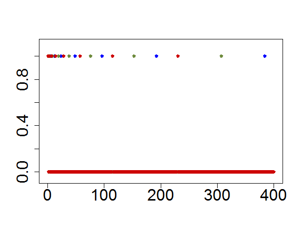

[](http://quantlet.de/)

## [](http://quantlet.de/) **MSMasprob** [](http://quantlet.de/)

```yaml

Name of QuantLet : MSMasprob

Published in : MSM

Description : 'Displays an example of which meets the convergence in mean square but not
convergence in almost sure series of the example. We select n = 400 and plot three cases: the
initial value of Z = 0.5 (blue), 0.2 (green), and 0.8 (dark red).'

Keywords : random-number-generation, process, dynamic, simulation, plot

See also : LAWS, clt, MSMpdfasymmetric, SFSmsr1

Author : Xiu Xu

Submitted : Thu, November 5 2015 by Chen Huang

Example : 'Plot of the series of a random variable satisfying convergence in mean square but not
convergence in almost sure.'

```




### R Code:
```r

# clear history
rm(list = ls(all = TRUE))
graphics.off()

n      = 1000
k      = floor(log(n)/log(2)) - 1
x      = matrix(0, nrow = n, ncol = 10)
x[1, ] = 1

z = c(0.5, 0.2, 0.4, 0.6, 0.8)
for (s in seq(2, length(z))) {
    for (i in seq(1, k)) {
        for (j in seq(0, 2^i)) {
          t       = 2^i + j
          x[t, 1] = (j * 2^(-i) <= 0.5) & (0.5 < (j + 1) * 2^(-i))
          x[t, s] = (j * 2^(-i) <= z[s]) & (z[s] < (j + 1) * 2^(-i))
          x       = x * 1
        }
    }
}

# Plot the time series
plot(x[1:400, 1], col = "blue", type = "p", pch = 20, lwd = 3,  
  ylim = c(-0.05, 1.1), ylab = "", xlab = "", cex.lab = 2, cex.axis = 2)
points(x[1:400, 2], col = "darkolivegreen4", type = "p", pch = 20, lwd = 3)
points(x[1:400, 5], col = "red3", type = "p", pch = 20, lwd = 3) 

```
